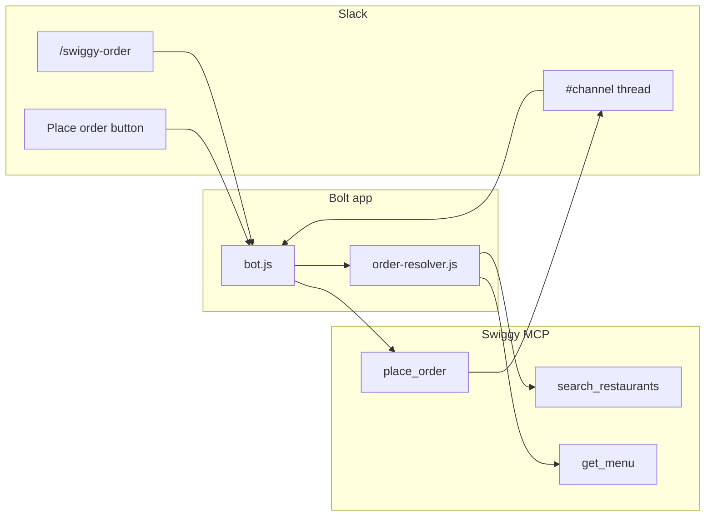

# Architecture

## One-line summary

Slack is the coordination surface; **Bolt** handles events and interactivity; **order-resolver** turns votes and budgets into a cart; **Swiggy MCP** is the commerce and fulfillment boundary.

## Flow (high level)

## Tech decisions

| Layer | Choice | Why |
|--------|--------|-----|
| Transport | Slack Bolt (HTTP or Socket Mode) | Native signing verification, Block Kit, scalable to many workspaces later. |
| Order logic | Node module `order-resolver.js` | Keeps AI heuristics testable without Slack; can swap LLM vs rules engine. |
| Commerce | Swiggy MCP client (`swiggy-mcp.js`) | Official tool surface for search, menu, and checkout — avoids scraping or unofficial APIs. |
| Demo | Static `demo/index.html` | Host on Vercel/Netlify as a zero-backend “product tour” for reviewers. |

## Data objects (conceptual)

- **Session** — thread_ts, organizer, budget per head, headcount, deadline.
- **Poll aggregate** — cuisine → vote count (from reactions or button actions).
- **Resolved cart** — restaurant id, line items with assignees, totals, per-person split.

## Security notes (for production)

- Never log full OAuth tokens or payment payloads.
- Validate Slack signatures on every request; verify `team_id` if multi-tenant.
- MCP calls run server-side only; the demo HTML does not call Swiggy directly.
