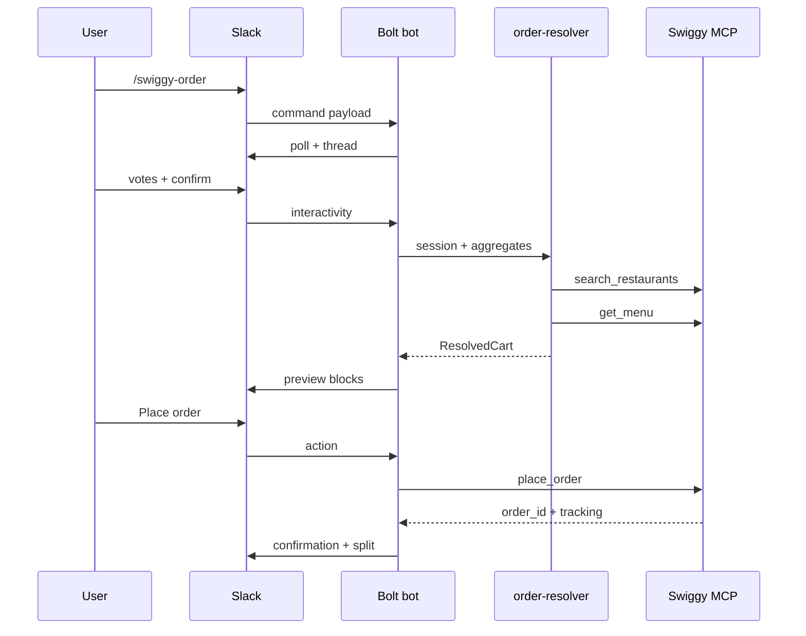

# Swiggy Food MCP integration

This document describes how the bot is intended to call the Swiggy MCP, how data moves through the stack, and how failures are handled. Tool names are **illustrative** — align field names and auth with the official Swiggy MCP release when available.

## Tools we plan to call

| Tool | Purpose | Typical inputs | Typical outputs |
|------|-----------|----------------|-----------------|
| `search_restaurants` | Shortlist venues that match cuisine votes, SLA, and budget | Geo (`lat`/`lng` or place id), cuisines[], `max_budget_per_head`, delivery time preference | Ranked `restaurant_id`, name, rating, ETA, delivery fee |
| `get_menu` | Fetch items for combinatorial “best cart” scoring | `restaurant_id`, optional dietary tags | Menu sections, item ids, prices, availability flags |
| `place_order` | Commit cart after human confirmation | Normalized cart (items, qty, customizations), address id, payment instrument reference | `order_id`, estimated arrival, tracking deep link |

## Data flow

1. **Slack event** — slash command or message with bot mention includes channel, user, and (after modal) budget + headcount.
2. **Bot logic** (`bot.js`) — persists session (e.g. Redis or DynamoDB in production), posts Block Kit poll, listens for votes until deadline.
3. **Resolver** (`order-resolver.js`) — reads poll results + constraints, calls `search_restaurants`, then `get_menu` for top candidates, produces one `ResolvedCart`.
4. **MCP call** — `place_order` runs only after an explicit “Place order” action from an authorized user (or role).
5. **Response** — bot updates the message with confirmation, order id, tracking URL, and a **bill split** block (computed locally from the cart; MCP may return line-level tax breakdown if exposed).

## Auth flow (outline)

- **Slack**: OAuth 2.0 with bot scopes `commands`, `chat:write`, `channels:history` (as needed), `users:read` for mentions — store bot token per workspace.
- **Swiggy MCP**: Follow provider docs for user or workspace-level linking. Expect:
  - Redirect-based OAuth for end users who pay individually, **or**
  - Corporate billing account with service credentials if Swiggy supports it.
- **Redirect URLs**: register exact callback URLs per environment (`https://api.yourdomain.com/oauth/swiggy/callback`, etc.); never commit secrets — use `.env` / secret manager.

## Error handling plan

| Scenario | User-visible behavior | Backend behavior |
|----------|----------------------|------------------|
| No restaurant matches filters | Ephemeral: “No delivery in budget — widen budget or cuisines?” | Log search params; suggest relax `max_budget_per_head` or radius. |
| Menu item became unavailable | Update cart preview; highlight removed lines | Re-run resolver with `exclude_item_ids` or next menu candidate. |
| `place_order` rejected (payment) | Thread message with retry + link to Swiggy account settings | Do not double-submit; idempotency key on order request if supported. |
| Budget exceeded after tax/fees | Block Kit summary in red; require re-confirm | Resolver adds fee buffer before presenting “within budget” badge. |
| MCP timeout / 5xx | “Swiggy is slow right now — try again in 2 min” | Exponential backoff; alert on repeated failures. |
| Slack rate limits | Queue posts; shrink Block Kit payloads | Respect `Retry-After` headers. |

## Versioning

Pin MCP schema versions in config when the server exposes them. Bump `order-resolver` when tool response shapes change so Slack UI mapping stays isolated.
